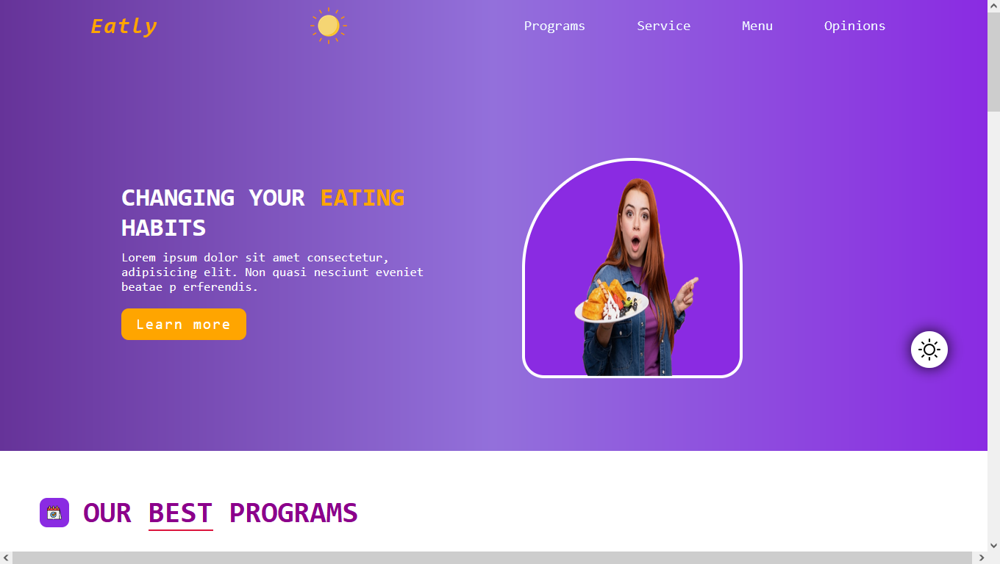
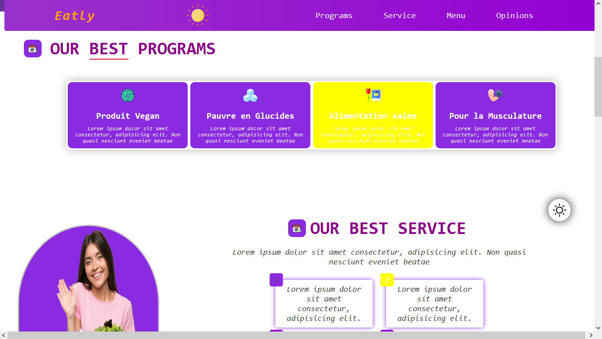
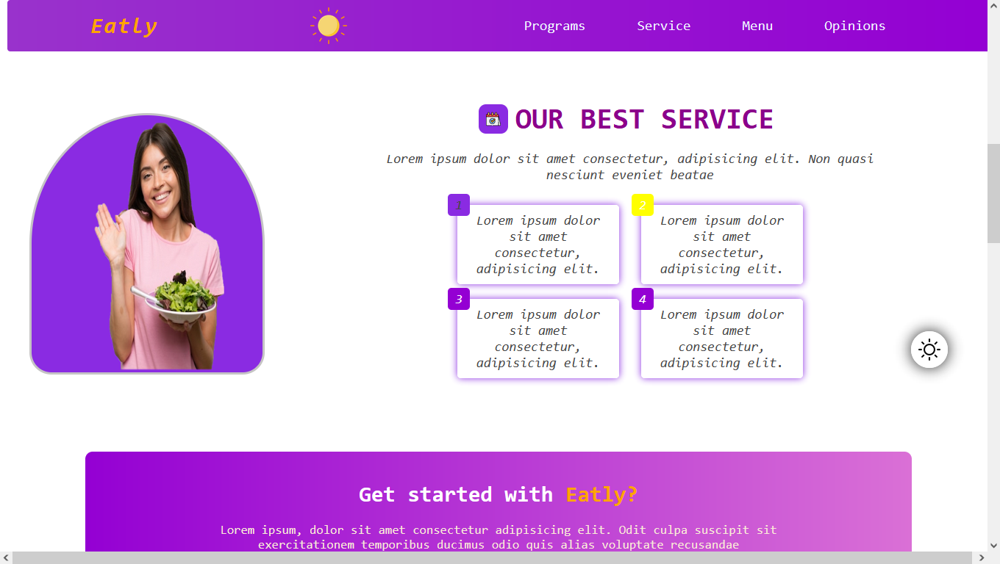
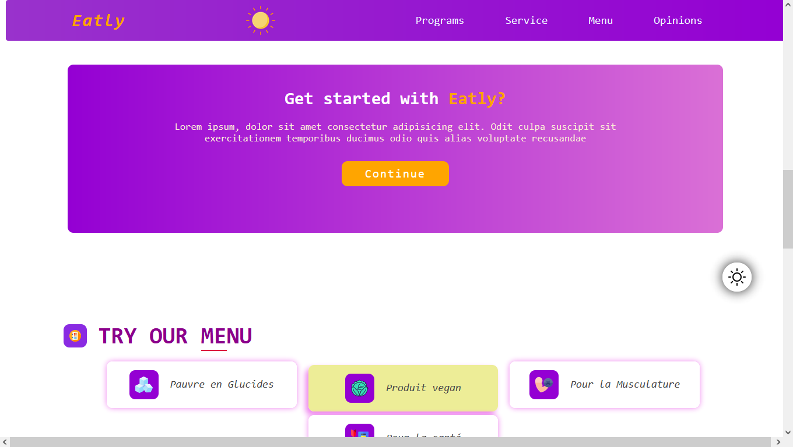
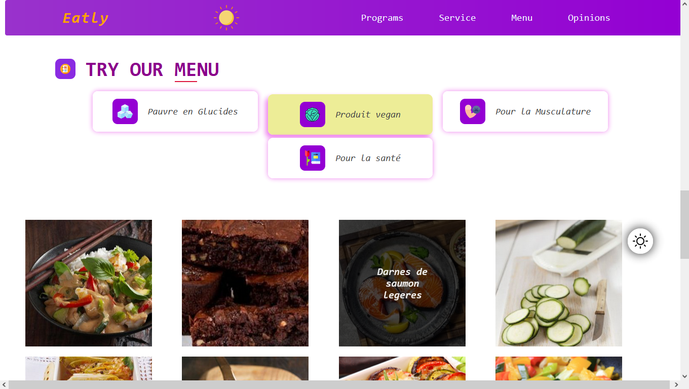
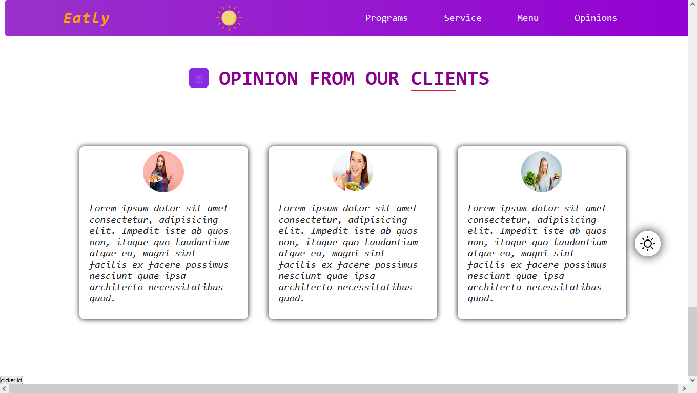

# HealthyEats-Frontend
Un projet front-end simple qui affiche des articles sur l'alimentation saine.

## Illustrations

## Contributions
Les contributions sont les bienvenues ! Veuillez ouvrir une issue ou soumettre une pull request pour toute amélioration ou correction de bugs.

## Contact
- **Nom** : Tendry Zéphyrin
- **Email** : tendryzephyrin@gmail.com
- **GitHub** : [Tendry-Rkt56](https://github.com/Tendry-Rkt56)